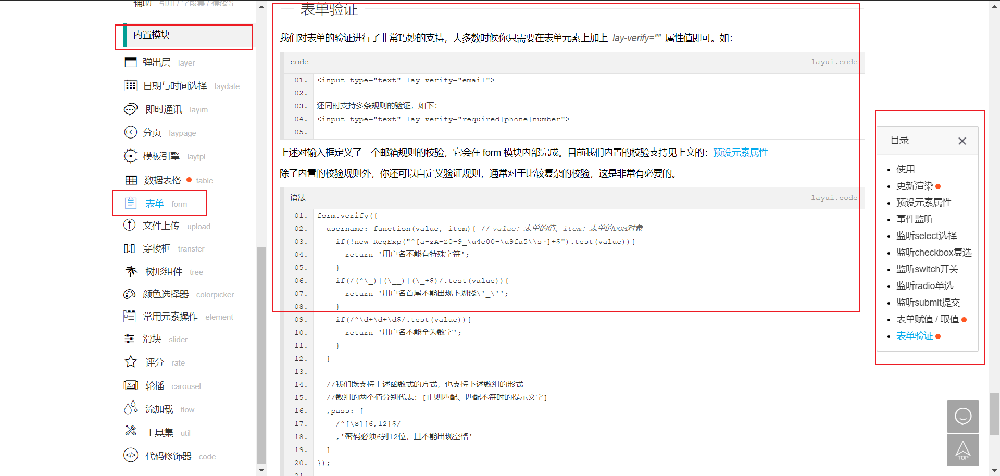
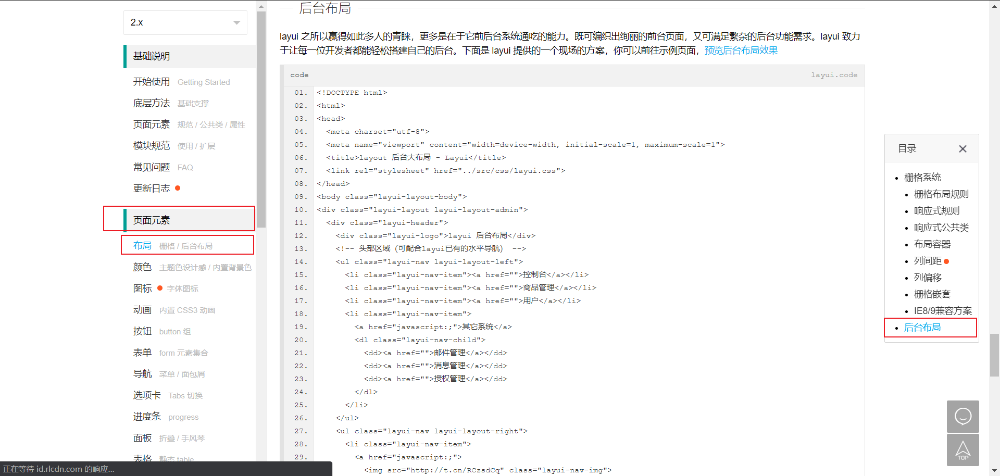
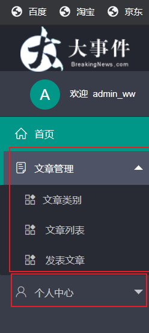

# 目标

- http://ajax.frontend.itheima.net
- 利用`Git`管理大事件项目代码
- 安装并且使用 `Live Server`插件
- 学会查阅`layui`文档
- 绘制出登录注册页面结构
- 添加表单元素自定义验证规则
- 查阅接口文档完成登录注册功能
- 知道`iframe`标签的使用
- 搭建后台主页界面

# 资源地址

1. 线上 `DEMO` 项目地址：http://www.escook.cn:8086/
2. 项目的 `API` 接口地址： https://www.showdoc.cc/escook?page_id=3707158761215217

# 0. 今天完成的功能效果

- 登录功能实现
- 注册功能实现
- 后台主页结构搭建


# 1. 项目前期的准备工作

## 1.1 项目结构搭建

- 将 `素材` 目录下的 `assets` 和 `home` 文件夹，拷贝到 `code` 目录下
  - `assets > css` 文件夹 自己编写的`css`代码
  - `assets > fonts` 字体图标文件夹
  - `assets > images`  存放图标文件夹
  - `assets > js` 自己`js`代码的文件夹
  - `assets > lib`  第三方依赖的文件夹
  - `home > dashboard.html` 后台首页的页面效果
- 在 `code` 目录下新建 `login.html` 和 `index.html` 页面

## 1.2 使用`GitHub`管理大事件的项目(⭐⭐⭐)

- 在 `code` 目录中运行 `git init` 命令，初始化仓库
- 在 `code` 目录中运行 `git add .` 命令，追踪要托管的文件
- 在 `code` 目录下运行 `git commit -m "init project"` 命令，提交到本地仓库
- 新建 `Github` 仓库 `web_bigevent`
  - 登录 `github` 官网
  - 点击左上角的 new 创建仓库，填写 `Repository nam`e，描述说明，点击 `Private` 选项，然后点击  `create repository`
- 将本地仓库和`Github`仓库建立关联关系
- 将本地仓库的代码推送到`Github`仓库中
- 运行 `git checkout -b login` 命令，创建并切换到 `login` 分支

# 2. `LayUI`

这里我们使用到的是 `layui`，先登录找到`layui`的[官方文档](https://www.layui.com/doc/)


## 使用的流程(⭐⭐⭐)

- 左侧是快捷导航，能够让我们快速找到对应的一些页面效果分类或者是功能分类
- 左侧选中我们想要的分类之后，右侧会有一个子分类，例如：左侧点击的布局，那么右侧是二级分类，里面有哪些布局的结构样式
- 当选中了对应的二级分类，就会跳转到对应效果那里
- 上面是示例效果
- 下面就是示例代码
- 我们需要做的就是找到对应效果的代码，`copy`到我们项目中，然后按照我们需要的效果进行调整即可

# 3. 登录注册功能

## 3.1 登录注册`UI`效果实现(⭐⭐⭐)

### 3.1.1 登录注册页面搭建

- 引入 `layui` 的`css`文件  `layui.css`，先引入第三方的，再引入自己的`css`
- 分为上下结构，上面头部的 `Logo` 区域
- 下面是 登录注册区域
- 修改一下对应样式，给body添加背景，给登录注册区域设置宽高，剧中显示，给里面title设置背景图片

**结构示例代码**

```html
<!DOCTYPE html>
<html lang="en">
  <head>
    <meta charset="UTF-8" />
    <meta name="viewport" content="width=device-width, initial-scale=1.0" />
    <title>大事件-登录/注册</title>
    <!-- 导入 LayUI 的样式 -->
    <link rel="stylesheet" href="/assets/lib/layui/css/layui.css" />
    <!-- 导入自己的样式表 -->
    <link rel="stylesheet" href="/assets/css/login.css" />
  </head>
  <body>
    <!-- 头部的 Logo 区域 -->
    <div class="layui-main">
      
    </div>

    <!-- 登录注册区域 -->
    <div class="loginAndRegBox">
      <div class="title-box"></div>
    </div>
  </body>
</html>
```

**`css`示例代码**

```css
html,
body {
  margin: 0;
  padding: 0;
  height: 100%;
  width: 100%;
  background: url('/assets/images/login_bg.jpg') no-repeat center;
  background-size: cover;
}

.loginAndRegBox {
  width: 400px;
  height: 310px;
  background-color: #fff;
  position: absolute;
  left: 50%;
  top: 50%;
  transform: translate(-50%, -50%);
}

.title-box {
  height: 60px;
  background: url('/assets/images/login_title.png') no-repeat center;
}
```

### 3.1.2 登录和注册的按需切换

- 在登录注册区域里面（`loginAndRegBox`）定义两个div
- 显然注册的div进行隐藏
- 给两个div绑定点击事件，点击了对应按钮，让对应的div进行显示，另外一个进行隐藏

**结构示例代码**

```html
<!-- 登录注册区域 -->
<div class="loginAndRegBox">
      <div class="title-box"></div>
      <!-- 登录的div -->
      <div class="login-box"></div>
      <!-- 注册的div -->
      <div class="reg-box"></div>
</div>
```

**`css`示例代码**

```css
.reg-box {
  display: none;
}
```

**`js`示例代码**

```javascript
$(function() {
  // 点击“去注册账号”的链接
  $('#link_reg').on('click', function() {
    $('.login-box').hide()
    $('.reg-box').show()
  })

  // 点击“去登录”的链接
  $('#link_login').on('click', function() {
    $('.login-box').show()
    $('.reg-box').hide()
  })
})
```

### 3.1.3 绘制登录表单的结构样式

- 找到 `layui` 文档的 `页面元素 -> 表单` 这一分类


- 拷贝 里面内容，不需要全部拷贝过来，我们拷贝第一行的输入框即可，注意：外面`form`表单域需要带上
- 删除里面的 `label` 提示内容，然后把`lable` 的父元素 `div` 进行删除，不然前面`label`删除了还有空隙在左侧
- 拷贝过来对应的 `button` 按钮，然后设置样式，让宽度填充整个父元素

**结构示例代码**

```html
  <!-- 登录的div -->
  <div class="login-box">
    <!-- 登录的表单 -->
    <form class="layui-form" action="">
      <!-- 用户名 -->
      <div class="layui-form-item">
        <i class="layui-icon layui-icon-username"></i>
        <input type="text" name="username" required lay-verify="required" placeholder="请输入用户名" autocomplete="off" class="layui-input" />
      </div>
      <!-- 密码 -->
      <div class="layui-form-item">
        <i class="layui-icon layui-icon-password"></i>
        <input type="password" name="password" required lay-verify="required" placeholder="请输入密码" autocomplete="off" class="layui-input" />
      </div>
      <!-- 登录按钮 -->
      <div class="layui-form-item">
        <!-- 注意：表单提交按钮和普通按钮的区别，就是 lay-submit 属性 -->
        <button class="layui-btn layui-btn-fluid layui-btn-normal" lay-submit>登录</button>
      </div>
      <div class="layui-form-item links">
        <a href="javascript:;" id="link_reg">去注册账号</a>
      </div>
    </form>
  </div>
```

**`css` 示例代码**

- 给 表单域设置内边距，左右留一点缝隙
- 给下面的 links 设置 flex 布局，让里面 a标签 居右边显示
- 修改 a 标签文字大小

```css
.layui-form {
  padding: 0 30px;
}

.links {
  display: flex;
  justify-content: flex-end;
}

.links a {
  font-size: 12px;
}
```

### 3.1.4 绘制文本框前面的小图标

- 在 `layui` 中给我们提供了一些图标，我们直接使用即可


- 在用户名的文本框之前，添加如下的标签结构

```html
<i class="layui-icon layui-icon-username"></i>
```

- 在密码框之前，添加如下的标签结构

```html
<i class="layui-icon layui-icon-password"></i>
```

- 修改一下对应样式

```css
.layui-form-item {
  position: relative;
}

.layui-icon {
  position: absolute;
  left: 10px;
  top: 10px;
}

.layui-input {
  padding-left: 32px;
}
```

### 3.1.5 绘制注册表单的结构样式

- 注册表单与登录是差不多的，多了一个 输入框，我们把之前登录的结构直接拷贝过来
- 修改一下里面对应内容

**结构示例代码**

```html
  <!-- 注册的div -->
  <div class="reg-box">
    <!-- 注册的表单 -->
    <form class="layui-form" action="">
      <!-- 用户名 -->
      <div class="layui-form-item">
        <i class="layui-icon layui-icon-username"></i>
        <input type="text" name="username" required lay-verify="required" placeholder="请输入用户名" autocomplete="off" class="layui-input" />
      </div>
      <!-- 密码 -->
      <div class="layui-form-item">
        <i class="layui-icon layui-icon-password"></i>
        <input type="password" name="password" required lay-verify="required" placeholder="请输入密码" autocomplete="off" class="layui-input" />
      </div>
      <!-- 密码确认框 -->
      <div class="layui-form-item">
        <i class="layui-icon layui-icon-password"></i>
        <input type="password" name="repassword" required lay-verify="required" placeholder="再次确认密码" autocomplete="off" class="layui-input" />
      </div>
      <!-- 注册按钮 -->
      <div class="layui-form-item">
        <!-- 注意：表单提交按钮和普通按钮的区别，就是 lay-submit 属性 -->
        <button class="layui-btn layui-btn-fluid layui-btn-normal" lay-submit>注册</button>
      </div>
      <div class="layui-form-item links">
        <a href="javascript:;" id="link_login">去登录</a>
      </div>
    </form>
  </div>
```

## 3.2 登录注册逻辑实现(⭐⭐⭐)

### 3.2.1 实现登录表单的验证

- 在`layui`中，默认有帮我们验证表单元素的逻辑



- 导入 `layui` 的 `js` 文件

```html
<script src="/assets/lib/layui/layui.all.js"></script>
```

- 为需要验证的表单项添加 `lay-verify` 属性，同时指定具体的校验规则即可

```html
<input type="text" name="username" required lay-verify="required" placeholder="请输入用户名" autocomplete="off" class="layui-input" />
```

### 3.2.2 自定义校验规则

- 通过查阅文档，我们只要如果需要去自定义校验规则，我们先要得到form模块对象

```javascript
var form = layui.form
```

- 通过 `form.verify()` 函数自定义校验规则，里面是 `key：value`形式，key后续对应设置到标签的 `lay-verity`属性中，`value`就是验证的规则，这里定义了两个自定义校验规则，一个是密码框，利用的是正则，一个是确认密码

```javascript
  form.verify({
    // 自定义了一个叫做 pwd 校验规则
    pwd: [/^[\S]{6,12}$/, '密码必须6到12位，且不能出现空格'],
    // 校验两次密码是否一致的规则
    repwd: function(value) {
      // 通过形参拿到的是确认密码框中的内容
      // 还需要拿到密码框中的内容
      // 然后进行一次等于的判断
      // 如果判断失败,则return一个提示消息即可
      var pwd = $('.reg-box [name=password]').val()
      if (pwd !== value) {
        return '两次密码不一致！'
      }
    }
  })
```

- 按需为表单项添加校验规则，如果有多个规则，用 | 隔开就好

```html
<input type="password" name="repassword" required lay-verify="required|pwd|repwd" placeholder="再次确认密码" autocomplete="off" class="layui-input" />
```

### 3.2.3 发起注册用户的Ajax请求

- 查阅[接口文档](https://www.showdoc.cc/escook?page_id=3707158761215217)，关注以下几个重点信息
  - 请求URL
  - 请求方式
  - 参数名
  - 响应数据


- 给按钮添加id，添加绑定事件，在事件处理函数里面先取消表单提交的默认行为

- 利用 `$.ajax()` 进行网络请求，注意添加根路径

  - `http://ajax.frontend.itheima.net`

- 请求成功之后提示用户

  - 利用 `layer.msg` 来进行提示

  - 获取到  `layer` 内置模块

    ```javascript
    var layer = layui.layer
    ```

  - 模拟用户点击了去登陆

**`js`示例代码**

```javascript
// 监听注册表单的提交事件
$('#form_reg').on('submit', function(e) {
    // 1. 阻止默认的提交行为
    e.preventDefault()
    // 2. 发起Ajax的POST请求
    var data = {
      username: $('#form_reg [name=username]').val(),
      password: $('#form_reg [name=password]').val()
    }
    $.post('http://ajax.frontend.itheima.net/api/reguser', data, function(res) {
      if (res.status !== 0) {
        return layer.msg(res.message)
      }
   layer.msg('注册成功，请登录！')
      // 模拟人的点击行为
      $('#link_login').click()
    })
})
```

### 3.2.4 发起登录的Ajax请求

- 查阅接口文档，关注几个重点要（请求URL，请求方式，请求参数，响应数据）
- 给按钮添加id，添加绑定事件，在事件处理函数里面先取消表单提交的默认行为
- 利用 `$.ajax()` 进行网络请求，注意添加根路径
- 请求成功之后提示用户，保持token信息，跳转到后台主页
  - token 用来标识用户是否登录的令牌，后台的页面需要用户登录之后才能查阅，那么权限校验的机制也就出来了，需要检验权限的页面后台先判断请求头里面是否有token，以此来判断是否是登录状态

**`js`示例代码**

```javascript
// 监听登录表单的提交事件
$('#form_login').submit(function(e) {
    // 阻止默认提交行为
    e.preventDefault()
    $.ajax({
      url: 'http://ajax.frontend.itheima.net/api/login',
      method: 'POST',
      // 快速获取表单中的数据
      data: $(this).serialize(),
      success: function(res) {
        if (res.status !== 0) {
          return layer.msg('登录失败！')
        }
        layer.msg('登录成功！')
        // 将登录成功得到的 token 字符串，保存到 localStorage 中
        localStorage.setItem('token', res.token)
        // 跳转到后台主页
        location.href = '/index.html'
      }
    })
})
```

### 3.2.5 在`ajaxPrefilter`中统一拼接请求的根路径

每次请求的时候都需要去添加根路径，比较的麻烦，如果根路径进行了修改，那么每个请求的页面都需要调整，那么`jQuery`中提供了一个 过滤器，可以帮我们统一去进行设置，而这个过滤器调用的时机是在我们调用 `$.ajax()` 之后，请求真正发给后台之前调用的： ​`$.ajax() > ajaxPrefilter过滤器 -> 发送请求给服务器`

- 在 `/assets/js` 目录中新建 `baseAPI.js`
- 调用 `$.ajaxPrefilter()` 函数，里面传递一个回调函数，回调函数里面有一个形成 `options`，这个形成里面就包含了这一次请求的相关信息

**`js`示例代码**

```javascript
// 注意：每次调用 $.get() 或 $.post() 或 $.ajax() 的时候，
// 会先调用 ajaxPrefilter 这个函数
// 在这个函数中，可以拿到我们给Ajax提供的配置对象
$.ajaxPrefilter(function(options) {
  // 在发起真正的 Ajax 请求之前，统一拼接请求的根路径
  options.url = 'http://ajax.frontend.itheima.net' + options.url
})
```

### 3.2.6 提交`login`分支的代码到`GitHub`

- 运行 `git add .` 命令
- 运行 `git commit -m "完成了登录和注册的功能"` 命令
- 运行 `git push -u origin login` 命令
- 运行 `git checkout master` 命令
- 运行 `git merge login` 命令
- 运行 `git push` 命令
- 运行 `git checkout -b index` 命令

# 4. 后台主页

## 4.1 快速实现后台主页的布局效果

- 找到`LayUI` 文档里面  页面元素 > 布局 > 后台布局



- 拷贝里面的代码，修改以下对应的文字内容

**结构示例代码**

```html
<!DOCTYPE html>
<html lang="en">
  <head>
    <meta charset="UTF-8" />
    <meta name="viewport" content="width=device-width, initial-scale=1.0" />
    <title>后台主页</title>
    <!-- 导入 layui 的样式表 -->
    <link rel="stylesheet" href="/assets/lib/layui/css/layui.css" />
  </head>
  <body class="layui-layout-body">
    <div class="layui-layout layui-layout-admin">
      <div class="layui-header">
        <div class="layui-logo">
          
        </div>
        <!-- 头部区域（可配合layui已有的水平导航） -->
        <ul class="layui-nav layui-layout-right">
          <li class="layui-nav-item">
            <a href="javascript:;">
              
              个人中心
            </a>
            <dl class="layui-nav-child">
              <dd><a href="">基本资料</a></dd>
              <dd><a href="">更换头像</a></dd>
              <dd><a href="">重置密码</a></dd>
            </dl>
          </li>
          <li class="layui-nav-item"><a href="">退出</a></li>
        </ul>
      </div>

      <div class="layui-side layui-bg-black">
        <div class="layui-side-scroll">
          <!-- 左侧导航区域（可配合layui已有的垂直导航） -->
          <ul class="layui-nav layui-nav-tree" lay-filter="test">
            <li class="layui-nav-item layui-nav-itemed">
              <a class="" href="javascript:;">所有商品</a>
              <dl class="layui-nav-child">
                <dd><a href="javascript:;">列表一</a></dd>
                <dd><a href="javascript:;">列表二</a></dd>
                <dd><a href="javascript:;">列表三</a></dd>
                <dd><a href="">超链接</a></dd>
              </dl>
            </li>
            <li class="layui-nav-item">
              <a href="javascript:;">解决方案</a>
              <dl class="layui-nav-child">
                <dd><a href="javascript:;">列表一</a></dd>
                <dd><a href="javascript:;">列表二</a></dd>
                <dd><a href="">超链接</a></dd>
              </dl>
            </li>
            <li class="layui-nav-item"><a href="">云市场</a></li>
            <li class="layui-nav-item"><a href="">发布商品</a></li>
          </ul>
        </div>
      </div>

      <div class="layui-body">
        <!-- 内容主体区域 -->
        <div style="padding: 15px;">内容主体区域</div>
      </div>

      <div class="layui-footer">
        <!-- 底部固定区域 -->
        © layui.com - 底部固定区域
      </div>
    </div>
    <!-- 导入 layui 的JS文件 -->
    <script src="/assets/lib/layui/layui.all.js"></script>
  </body>
</html>
```

## 4.2 修改侧边栏的结构(⭐⭐⭐)

- 找到没有二级分类的`li`，移植到第一个位置
- 对应修改里面的文字内容即可

**结构示例代码**

```html
<div class="layui-side layui-bg-black">
        <div class="layui-side-scroll">
          <!-- 左侧导航区域（可配合layui已有的垂直导航） -->
          <ul class="layui-nav layui-nav-tree">
            <li class="layui-nav-item">
              <a href="/">首页</a>
            </li>
            <li class="layui-nav-item">
              <a class="" href="javascript:;">文章管理</a>
              <dl class="layui-nav-child">
                <dd>
                  <a href="javascript:;">文章类别</a>
                </dd>
                <dd>
                  <a href="javascript:;">文章列表</a>
                </dd>
                <dd>
                  <a href="javascript:;">发布文章</a>
                </dd>
              </dl>
            </li>
            <li class="layui-nav-item">
              <a href="javascript:;">个人中心</a>
              <dl class="layui-nav-child">
                <dd>
                  <a href="javascript:;">基本资料</a>
                </dd>
                <dd>
                  <a href="javascript:;">更换头像</a>
                </dd>
                <dd>
                  <a href="javascript:;">重置密码</a>
                </dd>
              </dl>
            </li>
          </ul>
        </div>
</div>
```

## 4.3 使用`lay-shrink`实现左侧菜单互斥效果

目前效果是侧边栏的二级列表都可以展开，这个不是我们需要的效果，我们需要的是，一个二级列表展开之后，另外的二级列表需要关闭



- 只需要给侧边栏的`ul`添加一个 `lay-shrin` 属性

**示例代码**

```html
<div class="layui-side layui-bg-black">
   <div class="layui-side-scroll">
     <!-- 左侧导航区域（可配合layui已有的垂直导航） -->
     <ul class="layui-nav layui-nav-tree" lay-shrink="all">
       <!-- 省略其他代码 -->
     </ul>
   </div>
</div>
```

## 4.4 为菜单项添加图标

利用第三方的字体图标库来实现

- 导入第三方的图标库
- 哪个地方需要使用，添加 span标签，里面设置 `class` 类名 
  - 注意：`iconfont` 这个类名不能省略

```html
<!-- 导入第三方图标库 -->
<link rel="stylesheet" href="/assets/fonts/iconfont.css" />

...
  <div class="layui-side layui-bg-black">
    <div class="layui-side-scroll">
      <!-- 左侧导航区域（可配合layui已有的垂直导航） -->
      <ul class="layui-nav layui-nav-tree" lay-shrink="all">
        <li class="layui-nav-item">
          <a href=""><span class="iconfont icon-home"></span>首页</a>
        </li>
        <li class="layui-nav-item">
          <a class="" href="javascript:;"><span class="iconfont icon-16"></span>文章管理</a>
         ...
        </li>
        <li class="layui-nav-item">
          <a href="javascript:;"><span class="iconfont icon-user"></span>个人中心</a>
          ...
        </li>
      </ul>
    </div>
  </div>
```

- 修改头部“退出”按钮的结构

```html
<li class="layui-nav-item">
	<a href=""><span class="iconfont icon-tuichu"></span>退出</a>
</li>
```

- 导入自己的样式表文件

```html
<link rel="stylesheet" href="/assets/css/index.css" />
```

- 编写自己的样式

```css
.layui-footer {
  text-align: center;
  font-size: 12px;
}

.iconfont {
  margin-right: 8px;
}

.layui-icon {
  margin-right: 8px;
  margin-left: 20px;
}
```

## 4.5 使用`iframe`标签在内容主体区域显示网页内容(⭐⭐⭐)

如果每个导航栏对应的内容都写在一个页面中，会导致页面太臃肿，不利于维护，遵循模块化开发的思路，我们可以不同导航栏的内容是一个页面，这样我们就利用 `iframe` 来实现了

- 在页面主体的 div 中添加 `iframe`

```html
  <div class="layui-body">
    <!-- 内容主体区域 -->
    <iframe name="fm" src="" frameborder="0"></iframe>
  </div>
```

- 为`首页`链接添加`href`和`target`属性

```html
<a href="/home/dashboard.html" target="fm"><span class="iconfont icon-home"></span>首页</a>
```

- 设置对应样式

```css
iframe {
  width: 100%;
  height: 100%;
}

.layui-body {
  overflow: hidden;
}
```

- 指定默认 `iframe` 页面，添加 `src` 的属性即可

```html
<iframe name="fm" src="/home/dashboard.html" frameborder="0"></iframe>
```

- 为 `首页` 对应的导航 Item 项添加默认高亮效果， `layui-this` 属性

```html
<li class="layui-nav-item layui-this">
  <a href="/home/dashboard.html" target="fm"><span class="iconfont icon-home"></span>首页</a>
</li>
```

- 强制清除 `<a>` 链接的 `CSS3` 动画

```css
a {
  transition: none !important;
}
```

## 4.6 渲染图片头像和文字头像


- 找到对应的位置，添加如下结构

```html
<!-- 右侧导航栏上面头像 -->
<a href="javascript:;" class="userinfo">
  
  <span class="text-avatar">A</span>
  个人中心
</a>


<!-- 左侧侧边栏上面头像 -->
<div class="userinfo">
    
    <span class="text-avatar">A</span>
    <span id="welcome">欢迎 ***</span>
</div>
```

- 修改对应的样式

```css
.userinfo {
  height: 60px;
  line-height: 60px;
  text-align: center;
  font-size: 12px;
  user-select: none;
}

.layui-side-scroll .userinfo {
  border-bottom: 1px solid #282b33;
}

.layui-nav-img {
  width: 40px;
  height: 40px;
}

.text-avatar {
  display: inline-block;
  width: 40px;
  height: 40px;
  background-color: #009688;
  border-radius: 50%;
  line-height: 40px;
  text-align: center;
  font-size: 20px;
  color: #fff;
  position: relative;
  top: 4px;
  margin-right: 10px;
}
```

